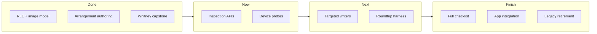

# Roadmap — OP-XY `.xy` format (start → finish)

> **Rewritten 2026-06-12.** Supersedes the 2026-06-09 tier list. This is the
> strategic plan; field-level status lives in
> [`parse_capability_checklist.md`](parse_capability_checklist.md); dated beliefs
> in [`state_of_understanding.md`](state_of_understanding.md); test backlog in
> [`engineering/known_good_test_plan.md`](engineering/known_good_test_plan.md).

## North star

**Read any guide-visible project state from a `.xy` file, write it back
correctly, and prove both in software and on hardware** — so tools like
`opxy_mtp_manager` can inspect, edit, and author projects off-device without
guesswork.



---

## How the docs fit together

| Doc | Role |
| --- | --- |
| **This file** | Phases, priorities, exit criteria |
| [`parse_capability_checklist.md`](parse_capability_checklist.md) | Per-field read/write/inspect status |
| [`state_of_understanding.md`](state_of_understanding.md) | Dated ledger of what we believed and when |
| [`engineering/known_good_test_plan.md`](engineering/known_good_test_plan.md) | Ranked corpus regression backlog (T001–T028) |
| [`format/opxy_user_guide_save_audit.md`](format/opxy_user_guide_save_audit.md) | User-guide feature → decode status |
| [`format/decoded_image_map.md`](format/decoded_image_map.md) | RAM offset reference |
| `user_probes/` (in `opxy_mtp_manager`) | Raw device captures + operator READMEs |

**Workflow for closing any gap:** capture → fixture → map → read and/or write API
→ test → checklist → log. See checklist § “How to close a gap” and § “Device
roundtrip workflow”.

---

## Phase 0 — Foundation ✅ (complete)

The serialization model and core authoring stack are **solved and device-proven**.

| Milestone | Evidence |
| --- | --- |
| Whole-file RLE codec | `xy/rle.py`, 245/246 corpus byte-exact |
| Decoded RAM struct map | `docs/format/decoded_image_map.md` |
| Image authoring | `xy/image_writer.py`, `docs/engineering/authoring.md` |
| Notes, p-locks, step components, scenes, songs | Writer methods + corpus tests |
| Preset donor copy | `ImageProject.set_preset()` — device probe 08 |
| Drum voice tune/play/start/end/gain | `set_drum_voice()` — `cap_drum_params.xy` |
| Multi-pattern + Whitney capstone | Loads and plays on device |

**Exit criteria:** met. No structural mysteries on the critical authoring path.

---

## Phase 1 — Inspection & read APIs 🔄 (in progress)

Goal: **reliably answer “what does this project contain?”** without manual hex.

### Done

| Item | Module / fixtures |
| --- | --- |
| Preset reference inference (per active pattern) | `xy/project_inspection.py`, `src/app-preset-probes/` |
| Drum sample paths (24 voices) | `xy/drum_sample_inspection.py`, `src/app-sample-probes/` |
| Inspector sections | `tools/inspect_xy.py` — `[Pattern Presets]`, `[Drum Samples]` |
| Parse capability checklist | `docs/parse_capability_checklist.md` |
| Drum path format doc (3 families) | `docs/format/drum_sample_paths.md` |

### Remaining (read)

| Priority | Item | Depends on |
| --- | --- | --- |
| P1 | Export preset refs + drum paths in `project_to_json` | Phase 1 writers optional |
| P1 | Structural preset path @ track `+0x453F` (not just heuristic fragments) | Corpus or probe |
| P2 | Static mixer values (vol/pan/send) beyond p-lock columns | Captures |
| P2 | One-shot / multisampler slot decode | Engine probes |
| P2 | Scene-stored track volumes | Scene captures |
| P3 | Auxiliary tracks T9–T16 semantics | Dedicated probes |
| P3 | Players (arpeggio / maestro / hold) | Dedicated probes |

**Exit criteria:** every **guide-visible** project field is either `[x]` read in
the checklist or explicitly deferred with rationale.

---

## Phase 2 — Device probe program 🔄 (active)

Goal: **one-variable captures** from your OP-XY that drive decode and tests.
Operator captures live in `opxy_mtp_manager/reference_material/user_probes/`;
promoted fixtures copy into `xy-format-fork/src/app-*-probes/`.

### Mission queue

| # | Topic | Status | Fixtures | Next step |
| --- | --- | --- | --- | --- |
| **1** | Drum sample paths | ✅ Done | `c1-*`, `c0-*` (archive) | Upstream PR optional |
| **2** | Preset on T5–P9 | ⏸ Skipped | — | Revisit if app needs per-pattern preset on upper tracks |
| **3** | Drum pan vs fade (`+0x05/+0x06`) | 🔄 **You** | `d0-baseline`, `d1-v03-pan`, `d2-v03-fade` | Analyze when captured → map bytes → `set_drum_voice` pan/fade |
| **4** | App-required A-series | 📦 Fixtures in repo | `a1–a4` t1–t4 × p1–p9 | Deepen preset inference tests; investigate P8/P9 kick silence |
| **5** | Phase B engine sweep | 📦 Partial | `b1-t1eng*` | Map engine/preset bytes; note bar-removal artifact in README |
| **6** | Pad → voice map (non-`pp` kits) | ⬜ Not started | — | One kit, three pads, same procedure as Mission 1 |

### Probe naming convention

Short, sortable names on device; expand on PC. See
`docs/workflows/device_test_naming.md` and `user_probes/*/README.md`.

**Exit criteria:** each open checklist gap in §8–§13 has either a probe plan or
a written “won’t fix / out of scope” note.

---

## Phase 3 — Targeted write APIs ⬜ (next)

Goal: **write what we can read**, not only copy from donors.

Reading is ahead of writing for the newest inspection work.

| Priority | Write API | Read status | Blocker |
| --- | --- | --- | --- |
| P0 | `set_drum_voice_path(track, voice, path)` | ✅ three path families decoded | Implement + device roundtrip |
| P0 | Drum pan / fade @ `+0x05/+0x06` | ~ provisional | Mission 3 captures |
| P1 | Preset path string @ `+0x453F` (not full donor copy) | ~ partial | Offset + encoding rules |
| P1 | Per-pattern preset assignment (multi-pattern) | ~ heuristic read | A-series analysis |
| P2 | One-shot / multisampler slot fields | gap | Slot map |
| P2 | Static mixer params | partial | Offset map |
| P3 | Full instrument param surface (M1–M4, mod matrix) | partial | Corpus sweeps |

**Note:** `set_preset(donor)` already copies drum tables and paths wholesale —
enough for “load kit X from another project,” not for “point voice 3 at
`content/samples/perc/chi box.wav`.”

**Exit criteria:** every checklist `[~]` write item is `[x]` or split into
documented sub-gaps.

---

## Phase 4 — Device roundtrip harness ⬜

Goal: **author → expect → MTP → load → capture → verify** as a repeatable
pipeline (you confirm UI; software checks bytes).

### Planned layout

```text
src/device-roundtrip-probes/
  drum-tune-v07/
    authored.xy           # ImageProject output
    expectations.yaml     # human-readable expected state
    capture.xy            # your Save As after device load (optional)
    README.md             # operator notes
```

### Build steps

1. **Schema** — `expectations.yaml`: tempo, preset refs, drum paths per voice,
   tune, etc.
2. **Author script** — small CLI or pytest fixture that builds `authored.xy`.
3. **Verifier** — compares `inspect_xy` / inspection modules to expectations.
4. **Device step** — manual: you load, confirm/reject; re-save → `capture.xy`.
5. **Byte test** — where writer is byte-exact (`test_image_writer` pattern),
   compare authored vs capture decoded image.

Start with **drum tune** (writer exists). Then **drum path** after Phase 3.

**Exit criteria:** one end-to-end documented probe per major subsystem (drum,
preset, note, scene).

---

## Phase 5 — Corpus & regression hardening 🔄

Goal: **CI confidence** on the legacy one-off corpus + new app probes.

Follow [`engineering/known_good_test_plan.md`](engineering/known_good_test_plan.md):

| Wave | Focus | Exit |
| --- | --- | --- |
| **A (P0)** | T005–T012: multi-pattern, pointer-tail, crash guards | No known-crash regressions |
| **B (P1)** | T014–T022: notes, step components, p-locks | Explicit fixtures per subsystem |
| **C (P2/P3)** | T023–T028: scenes, mix, edge anomalies | Pass or deferred with rationale |

Parallel: keep `tools/roundtrip_xy.py` green on corpus; extend to app-probe dirs.

**Exit criteria:** `pytest` + corpus roundtrip gate documented in CI/README.

---

## Phase 6 — Product integration ⬜

### 6a — Upstream `kmorrill/xy-format`

| PR / branch | Content | Status |
| --- | --- | --- |
| [#2](https://github.com/kmorrill/xy-format/pull/2) preset inspection | `project_inspection`, checklist | Open |
| Drum sample paths | `drum_sample_inspection`, fixtures, docs | On `swekkiekekkie/xy-format` `main`; PR not opened |

### 6b — `opxy_mtp_manager`

| Item | Depends on |
| --- | --- |
| Vendor or submodule `xy-format` at merged `main` | Phase 1 stable |
| Project library UI: preset per pattern, drum sample paths | Inspection APIs ✅ |
| MTP upload authored `.xy` | Phase 4 |
| Edit flows (tune, swap sample, preset) | Phase 3 writers |

### 6c — Authoring products

| Item | Notes |
| --- | --- |
| **midi_to_xy v2** on image writer | Replace scaffold/transplant; drop velocity nudge |
| JSON project spec completeness | `docs/engineering/json_project_spec_complete.md` |
| Retire legacy paths | `xy/writer.py`, descriptor lookups, superseded issue docs |

**Exit criteria:** app can list projects with correct preset + drum info; one
authored edit round-trips on your device.

---

## Phase 7 — Remaining field semantics ⬜ (corpus-first)

Work that needs **no device** (or only confirmation glances):

1. **P-lock column map** — CC capture corpus vs `docs/format/plocks.md`
2. **Step-component byte order** — complete 16-byte slot map (unnamed 8/9, 59–77)
3. **Engine/preset param blocks** — engine-change one-offs (34, 85, 91, 94, 113, 116, 117)
4. **Enum probes** (cheap device): scene-row flags, note trailing flags semantics,
   limits pack (99 scenes, 120 notes, etc.)

Tooling: `tools/analysis/decoded_diff.py` × change log.

**Exit criteria:** `opxy_user_guide_save_audit.md` has no unexplained “gap” rows
for features you care about.

---

## Phase 8 — Cleanup & maintenance ⬜

- Close or archive superseded issues (`pointer_tail`, `preamble_state_machine`, …)
- Banner/delete retired writer modules once midi_to_xy v2 lands
- Keep `state_of_understanding.md` append-only for breakthroughs
- Bump checklist + this roadmap when phases complete

---

## Suggested order of work (practical)

For **you + this repo right now**:

1. Finish **Mission 3** (pan/fade) → merge analysis → writer + checklist
2. Open **upstream PR** for drum sample inspection (or combine with #2)
3. Scaffold **Phase 4** with drum-tune roundtrip (quick win)
4. Implement **`set_drum_voice_path`** + device test (highest-value write gap)
5. Wire **`opxy_mtp_manager`** to inspection APIs
6. Chip **Phase 5** Wave A while using probes for Phase 7
7. **midi_to_xy v2** when edit surface is broad enough

---

## Done (highlights)

| Date | Item |
| --- | --- |
| 2026-06-09 | Serialization model; RLE; image writer; Whitney device pass |
| 2026-06-09 | Preset donor copy; drum tune write; Tier-2 device probes 4/4 |
| 2026-06-09 | App preset probe inspection + 76 fixtures; checklist; PR #2 |
| 2026-06-12 | Drum sample path read API; 3 path families; round 0 + round 1 fixtures |
| 2026-06-12 | Merged preset + drum inspection to `main` (`swekkiekekkie/xy-format`) |

---

## Related

- Docs index: [`docs/index.md`](index.md)
- Operating rules: [`AGENTS.md`](../AGENTS.md)
- User probe hub: `opxy_mtp_manager/reference_material/user_probes/`
